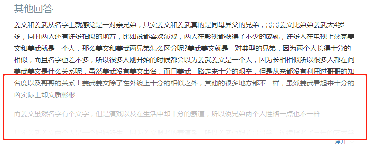

### 渐隐效果



```less
.long-question-wrap {
  position: relative;
  left: 0;
  top: 0;
  width: 100%;
  height: 240px;
  overflow: hidden;
  .long-question-mask {
    position: absolute;
    left: 0;
    bottom: 0;
    z-index: 10;
    width: 100%;
    height: 144px;
    background-image: linear-gradient(rgba(255,255,255,0) 0,#fff 100%);
  }
}
```


